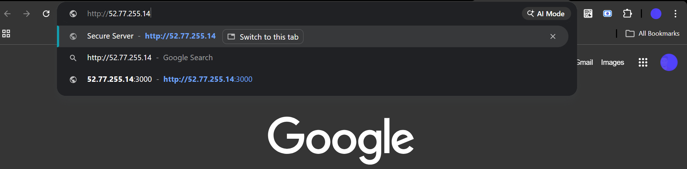
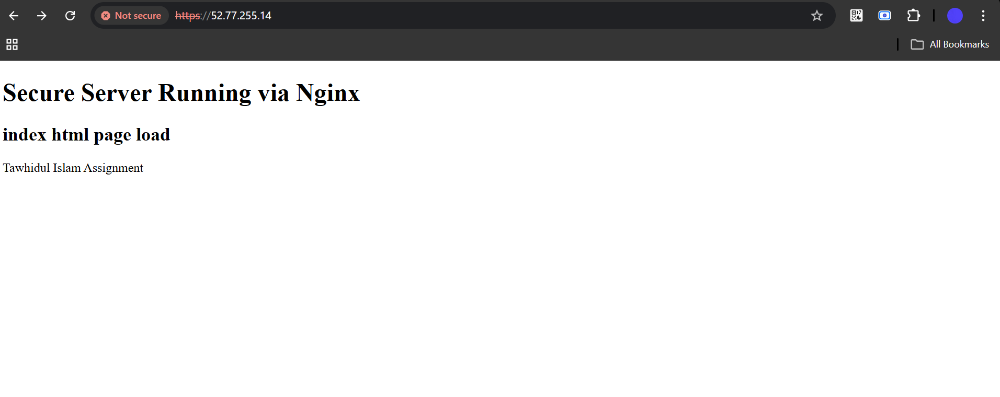
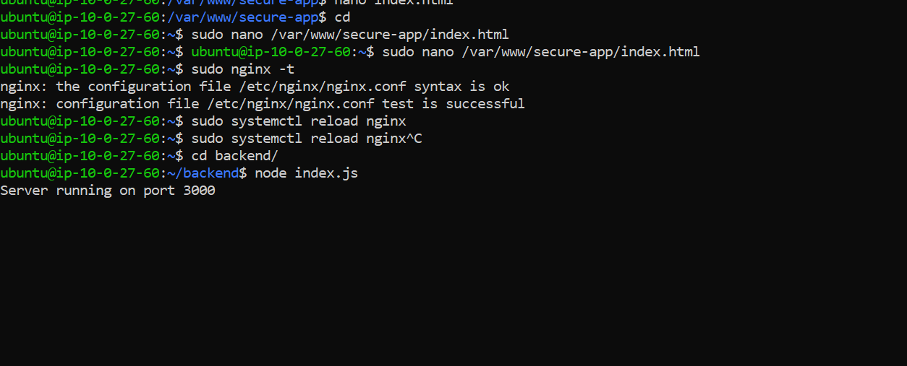
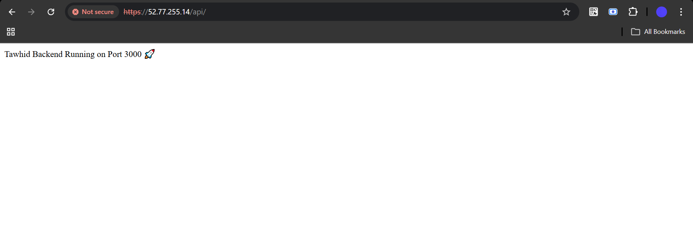

# Nginx Secure Web Server with HTTPS and Reverse Proxy

This project demonstrates how to set up a secure, production-like web server using Nginx on Linux. It includes static website hosting, HTTPS using a self-signed SSL certificate, automatic HTTP to HTTPS redirection, and reverse proxy configuration to a backend server.

---

## Features

* Static website hosting with Nginx
* HTTPS enabled using self-signed SSL
* Automatic redirect from HTTP to HTTPS
* Reverse proxy to backend server on port `3000`
* Tested and verified configuration

---

## Tech Stack

* Linux (Ubuntu on AWS EC2)
* Nginx
* OpenSSL
* Node.js

---

## Project Structure

```text
nginx-secure-server/
|
|-- README.md
|-- nginx/
|   `-- secure-app.conf
|-- website/
|   `-- index.html
|-- backend/
|   `-- app.js
`-- screenshot/
```

---

## Setup Instructions

### 1. Install Nginx and OpenSSL

```bash
sudo apt update
sudo apt install nginx -y
sudo apt install openssl -y
```

---

### 2. Create Project Directory

```bash
sudo mkdir -p /var/www/secure-app
```

---

### 3. Add Static HTML File

```bash
sudo nano /var/www/secure-app/index.html
```

```html
<h1>Secure Server Running via Nginx</h1>
```

---

### 4. Generate Self-Signed SSL Certificate

```bash
sudo mkdir -p /etc/nginx/ssl

sudo openssl req -x509 -nodes -days 365 \
  -newkey rsa:2048 \
  -keyout /etc/nginx/ssl/selfsigned.key \
  -out /etc/nginx/ssl/selfsigned.crt
```

---

### 5. Nginx Configuration

Create a new config file:

```bash
sudo nano /etc/nginx/sites-available/secure-app
```

Add the following configuration:

```nginx
server {
    listen 80;
    server_name _;

    return 301 https://$host$request_uri;
}

server {
    listen 443 ssl;
    server_name _;

    ssl_certificate /etc/nginx/ssl/selfsigned.crt;
    ssl_certificate_key /etc/nginx/ssl/selfsigned.key;

    root /var/www/secure-app;
    index index.html;

    location / {
        try_files $uri $uri/ =404;
    }

    location /api/ {
        proxy_pass http://localhost:3000/;
        proxy_set_header Host $host;
        proxy_set_header X-Real-IP $remote_addr;
    }
}
```

---

### 6. Enable Configuration

```bash
sudo ln -s /etc/nginx/sites-available/secure-app /etc/nginx/sites-enabled/
sudo nginx -t
sudo systemctl reload nginx
```

---

### 7. Run Backend Server

```bash
node app.js
```

---

## Testing

### Test Nginx Configuration

```bash
sudo nginx -t
```

---

### Reload Nginx

```bash
sudo systemctl reload nginx
```

---

## Access URLs

* HTTP: `http://your-server-ip`
* HTTPS: `https://your-server-ip`
* Backend API: `https://your-server-ip/api`

---

## Screenshots

The following screenshots show the required verification steps:

### 1. HTTP to HTTPS Redirect
<p align="center">
  
</p>

### 2. HTTPS Working in Browser
<p align="center">
  
</p>

### 3. Static Website Display
<p align="center">
  
</p>

### 4. Backend Response via Nginx
<p align="center">
  
</p>

---

## Notes

* A self-signed SSL certificate may show a browser warning. This is expected.
* This setup simulates a production-like environment for learning and testing.

---

## Submission

* GitHub repository link
* Complete `README.md`
* Nginx configuration file
* Screenshots

---

## Author

**Tawhidul Islam**  
Web Developer
